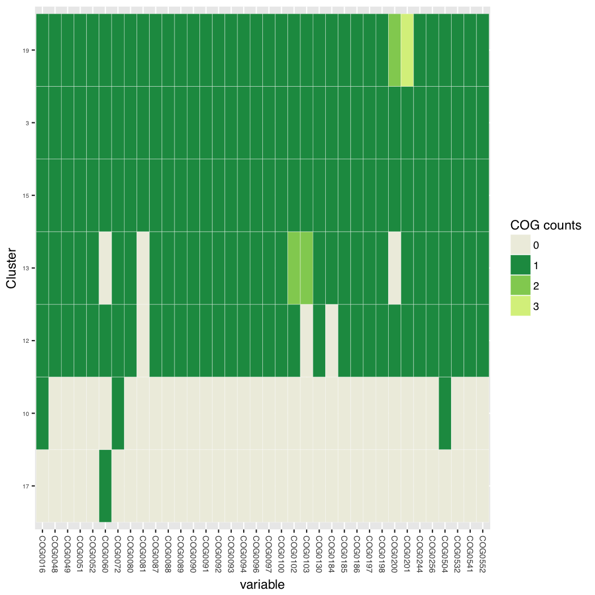
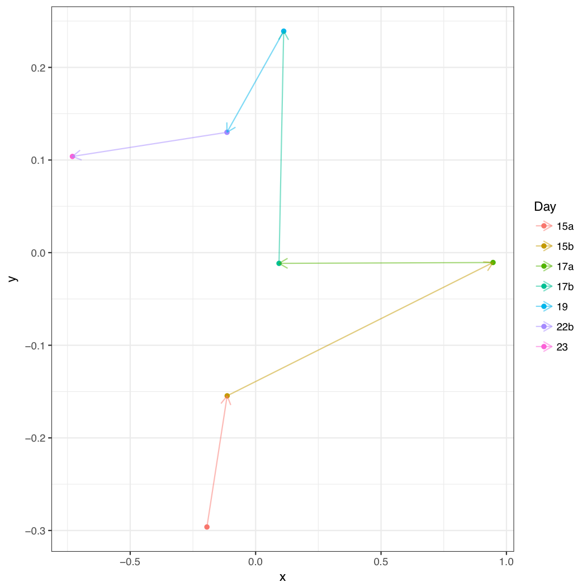
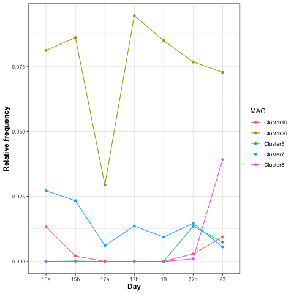
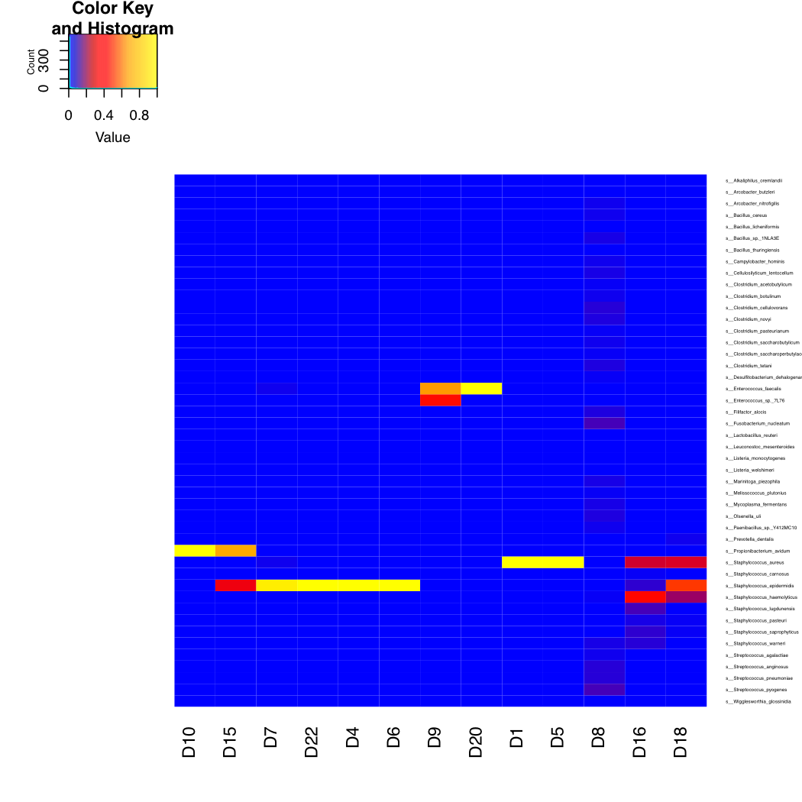
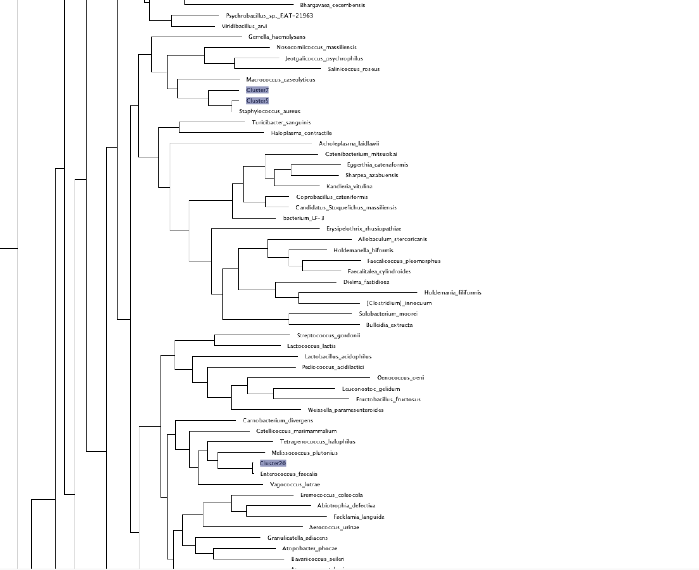

<a name="assembly"/>

# Assembly based metagenomics analysis

Assembly based metagenomics represents a complex analysis pathway:


1. [Coassembly](#coassembly)

2. [Read mapping](#readmapping)

3. [Contig binning](#binning)

4. [MAG annotation](#MAGs)

Login into your VM

We are now going to perform a basic assembly based metagenomics analysis of these same samples. 
This will involve a collection of different software programs:

1. megahit: A highly efficient metagenomics assembler currently our default for most studies

2. bwa: Necessary for mapping reads onto contigs

3. [samtools] (http://www.htslib.org/download/): Utilities for processing mapped files

4. CONCOCT: Our own contig binning algorithm

5. [prodigal] (https://github.com/hyattpd/prodigal/releases/): Used for calling genes on contigs

6. [gnu parallel] (http://www.gnu.org/software/parallel/): Used for parallelising rps-blast

7. [standalone blast] (http://www.ncbi.nlm.nih.gov/books/NBK52640/): Needs rps-blast

8. [COG RPS database] (ftp://ftp.ncbi.nih.gov/pub/mmdb/cdd/little_endian/): Cog databases

9. [GFF python parser] (https://github.com/chapmanb/bcbb/tree/master/gff)

<a name="coassembly"/>

## Assembly

Start off by creating a new working directory and linking in the infant gut samples:
```
cd ~/Projects/InfantGut/
```

First let's try assembling a single sample with default parameters:
```
megahit -1 ReadsSub/sample1_R1.fastq -2 ReadsSub/sample1_R2.fastq -o Assembly1
```

```
contig-stats.pl < Assembly1/final.contigs.fa
```


Compare to a spades assembly without noise removal:
```
spades.py --only-assembler --meta -1 ReadsSub/sample1_R1.fastq -2 ReadsSub/sample1_R2.fastq -o AssemblyS -t 12 -k 23,55,77
```

Which is better?

```
contig-stats.pl < AssemblyS/contigs.fasta 
sequence #: 4783	total length: 7931965	max length: 542671	N50: 18116	N90: 449
```

## Co-assembly

We will now perform a co-assembly of all these samples using 
megahit:

```
cd ~/Projets/InfantGut
ls ReadsSub/*R1.fastq | tr "\n" "," | sed 's/,$//' > R1.csv
ls ReadsSub/*R2.fastq | tr "\n" "," | sed 's/,$//' > R2.csv
```

```
nohup megahit -1 $(<R1.csv) -2 $(<R2.csv) -t 12 -o Assembly > megahit.out&
```

```
contig-stats.pl < Assembly/final.contigs.fa
```

Should see results like:
```
sequence #: 9920	total length: 16683496	max length: 628146	N50: 8525	N90: 447
```

Discussion point what is N50?


<a name="readmapping"/>

## Read mapping

Then cut up contigs:

```bash
python $CONCOCT/scripts/cut_up_fasta.py -c 10000 -o 0 -m Assembly/final.contigs.fa > Assembly/final_contigs_c10K.fa
```

Having cut-up the contigs the next step is to map all the reads from each sample back onto them. First index the contigs with bwa:

```bash
cd Assembly
bwa index final_contigs_c10K.fa
cd ..
```

Then perform the actual mapping you may want to put this in a shell script:

```bash
mkdir Map

for file in ./ReadsSub/*R1.fastq
do 
   
   stub=${file%_R1.fastq}
   name=${stub##*/}
   
   echo $stub

   file2=${stub}_R2.fastq

   bwa mem -t 12 Assembly/final_contigs_c10K.fa $file $file2 > Map/${name}.sam
done
```

And calculate coverages:

```
python $DESMAN/scripts/Lengths.py -i Assembly/final_contigs_c10K.fa > Assembly/Lengths.txt

for file in Map/*.sam
do
    stub=${file%.sam}
    stub2=${stub#Map\/}
    echo $stub  
    (samtools view -h -b -S $file > ${stub}.bam;samtools view -b -F 4 ${stub}.bam > ${stub}.mapped.bam;samtools sort -m 1000000000 ${stub}.mapped.bam -o ${stub}.mapped.sorted.bam; bedtools genomecov -ibam ${stub}.mapped.sorted.bam -g Assembly/Lengths.txt > ${stub}_cov.txt)&
done
```
Collate coverages together:

```
for i in Map/*_cov.txt 
do 
   echo $i
   stub=${i%_cov.txt}
   stub=${stub#Map\/}
   echo $stub
   awk -F"\t" '{l[$1]=l[$1]+($2 *$3);r[$1]=$4} END {for (i in l){print i","(l[i]/r[i])}}' $i > Map/${stub}_cov.csv
done

$DESMAN/scripts/Collate.pl Map > Coverage.csv
```

<a name="binning"/>

## Contig binning

Now we can run CONCOCT:
```

    mkdir Concoct

    mv Coverage.csv Concoct

    cd Concoct

    tr "," "\t" < Coverage.csv > Coverage.tsv

    concoct --coverage_file Coverage.tsv --composition_file ../Assembly/final_contigs_c10K.fa -t 12 

```

Find genes using prodigal:
```
    cd ..
    
    mkdir Annotate

    cd Annotate/

    python $DESMAN/scripts/LengthFilter.py ../Assembly/final_contigs_c10K.fa -m 1000 >     final_contigs_gt1000_c10K.fa

    prodigal -i final_contigs_gt1000_c10K.fa -a final_contigs_gt1000_c10K.faa -d     final_contigs_gt1000_c10K.fna  -f gff -p meta -o final_contigs_gt1000_c10K.gff 
```

Assign COGs change the -c flag which sets number of parallel processes appropriately:
```
    export COGSDB_DIR=~/Databases/rpsblast_cog_db
    $CONCOCT/scripts/RPSBLAST.sh -f final_contigs_gt1000_c10K.faa -p -c 12 -r 1
```

Now we calculate scg frequencies on the CONCOCT clusters:
```
cd ../Concoct
python $CONCOCT/scripts/COG_table.py -b ../Annotate/final_contigs_gt1000_c10K.out  -m $CONCOCT/scgs/scg_cogs_min0.97_max1.03_unique_genera.txt -c clustering_gt1000.csv  --cdd_cog_file $CONCOCT/scgs/cdd_to_cog.tsv > clustering_gt1000_scg.tsv
```

This should result in 5 clusters with 75% single copy copy SCGs:

## Can also run CheckM on individual clusters

CheckM is a very useful 3rd party program for cluster validation...

```
cd ~/Projects/InfantGut/Split
checkm lineage_wf -t 8 -x fa Cluster7 Cluster7_cm
```
<a name="MAGs"/>

## Metagenome assembled genomes (MAGs)

First let us look at the cluster completeness:
```
$CONCOCT/scripts/COGPlot.R -s clustering_gt1000_scg.tsv -o clustering_gt1000_scg.pdf
```

 

Discussion point what is a MAG?

Then we calculate coverage of each cluster/MAG in each sample.
```
sed '1d' clustering_gt1000.csv > clustering_gt1000R.csv
python $DESMAN/scripts/ClusterMeanCov.py Coverage.csv clustering_gt1000R.csv ../Assembly/final_contigs_c10K.fa > clustering_gt1000_cov.csv
sed 's/Map\///g' clustering_gt1000_cov.csv > clustering_gt1000_covR.csv
```

Discussion point, how do we calculate cluster coverages?

```
cp ~/bin/ClusterCovNMDS.R .
Rscript ./ClusterCovNMDS.R
```

How well does this correlate with time/replicates.

 


Also plot some time series:

```
cd ~/repos
git clone https://github.com/chrisquince/PenrynTutorial.git
cd ~/Projects/InfantGut/Concoct
cp ~/repos/PenrynTutorial/TimeSeries.R .
cp ~/Data/InfantGut/sharon_mappingR.txt .
```

 

## Annotate MAGs

First lets label COGs on genes:
```
cd ~/Projects/InfantGut/Annotate
python $DESMAN/scripts/ExtractCogs.py -b final_contigs_gt1000_c10K.out --cdd_cog_file $CONCOCT/scgs/cdd_to_cog.tsv -g final_contigs_gt1000_c10K.gff > final_contigs_gt1000_c10K.cogs
```

Discussion point what is a COG?

Then genes:
```
python $DESMAN/scripts/ExtractGenes.py -g final_contigs_gt1000_c10K.gff > final_contigs_gt1000_c10K.genes
cd ..
```

Return to the analysis directory and create a new directory to bin the contigs into:

```
mkdir Split
cd Split
$DESMAN/scripts/SplitClusters.pl ../Annotate/final_contigs_gt1000_c10K.fa ../Concoct/clustering_gt1000.csv
SplitCOGs.pl ../Annotate/final_contigs_gt1000_c10K.cogs ../Concoct/clustering_gt1000.csv
SplitGenes.pl ../Annotate/final_contigs_gt1000_c10K.genes ../Concoct/clustering_gt1000.csv
SplitFaa.pl ../Annotate/final_contigs_gt1000_c10K.faa ../Concoct/clustering_gt1000.csv

```

## Taxonomic Classification of Contigs

```
cd ~/Projects/InfantGut/Annotate
kraken --db ~/Databases/minikraken_20141208/ --threads 8 --preload --output final_contigs_gt1000_c10K.krak final_contigs_gt1000_c10K.fa
```

```
kraken-report --db ~/Databases/minikraken_20141208/ final_contigs_gt1000_c10K.krak 
```

```
kraken-translate --mpa-format --db ~/Databases/minikraken_20141208/ final_contigs_gt1000_c10K.krak > final_contigs_gt1000_c10K.krak.mpi.tran
```

```
cut -f2 final_contigs_gt1000_c10K.krak.mpi.tran | cut -d"|" -f7 > SpeciesAss.txt
cut -f1 final_contigs_gt1000_c10K.krak.mpi.tran > Ids.txt
paste Ids.txt SpeciesAss.txt | grep "s__" | tr "\t" "," > Contig_Species.csv
```


These can then be used for a cluster confusion plot:
```
$CONCOCT/scripts/Validate.pl --cfile=../Concoct/clustering_gt1000.csv --sfile=Contig_Species.csv --ffile=../Assembly/final_contigs_c10K.fa --ofile=Taxa_Conf.csv
```
Now your results may be somewhat different...
```
N	M	TL	S	K	Rec.	Prec.	NMI	Rand	AdjRand
2356	1720	1.0855e+07	46	22	0.958779	0.939837	0.883243	0.979203	0.939598
```

Then plot:
```
$CONCOCT/scripts/ConfPlot.R -c Taxa_Conf.csv -o Taxa_Conf.pdf
```



## Construct a phylogenetic tree

Assume we are starting from the 'Split' directory in which we have seperated out the cluster fasta files and we have done the COG assignments for each cluster. Then the first step is to extract each of the 36 conserved core COGs individually. There is an example bash script GetSCG.sh for doing this in phyloscripts but it will need modifying:

```
cd ~/Projects/InfantGut/Split
cp ~/repos/MAGAnalysis/cogs.txt .
mkdir SCGs

while read line
do
    cog=$line
    echo $cog
     ~/repos/MAGAnalysis/phyloscripts/SelectCogsSCG.pl ../Concoct/clustering_gt1000_scg.tsv ../Annotate/final_contigs_gt1000_c10K.fna $cog > SCGs/$cog.ffn
done < cogs.txt
``` 

Run this after making a directory SCGs and it will create one file for each SCG with the corresponding nucleotide sequences from each cluster but only for this with completeness (> 0.75) hard coded in the perl script somewhere you should check that :)

Then we align each of these cog files against my prepared database containing 1 genome from each bacterial genera and archael species:
```
mkdir AlignAll

while read line
do
    cog=$line
    echo $cog
    cat ~/Databases/NCBI/Cogs/All_$cog.ffn SCGs/${cog}.ffn > AlignAll/${cog}_all.ffn
    mafft --thread 12 AlignAll/${cog}_all.ffn > AlignAll/${cog}_all.gffn
done < cogs.txt
```

Then trim alignments:

```
rm AlignAll/_all.*

for file in  AlignAll/*gffn
do
    echo $stub
    stub=${file%.gffn}
    trimal -in $file -out ${stub}_al.gfa -gt 0.9 -cons 60
done
```

The next script requires the IDs of any cluster or taxa that may appear in fasta files, therefore:

```
cat AlignAll/*gffn | grep ">" | sed 's/_COG.*//' | sort | uniq | sed 's/>//g' > Names.txt
```

Which we run as follows:

```
~/repos/MAGAnalysis/phyloscripts/CombineGenes.pl Names.txt AlignAll/COG0*_al.gfa > AlignAll.gfa
```

Then we may want to map taxaids to species names before building tree:

```
~/repos/MAGAnalysis/phyloscripts/MapTI.pl /home/ubuntu/repos/MAGAnalysis/data/TaxaSpeciesR.txt < AlignAll.gfa > AlignAllR.gfa
```

Finally we get to build our tree:

```
fasttreeMP -nt -gtr < AlignAllR.gfa 2> SelectR.out > AlignAllR.tree
```

Visualise this locally with FigTree or on the web with ITOL



## Kegg orthologs

Kegg ortholog assignment on genes:
```
python ~/bin/CompleteClusters.py ../Concoct/clustering_gt1000_scg.tsv > Cluster75.txt
```

```
    while read line
    do 
        file=${line}/${line}.faa
        stub=${file%.faa}
        base=${stub##*/}
        echo $base

        diamond blastp -d $KEGG_DB/genes/fasta/genes.dmnd -q $file -o ${stub}.m8 > $file.d.out&
    done < Cluster75.txt
```

Probably too slow so run this instead:

```
while read line
do 
    echo $file
  
    file=${line}/${line}.m8
  
    cp ~/Projects_run/InfantGut/Split/$file $file
  
done < Cluster75.txt
```


Discussion point why blastp rather than blastx?

The above maps onto Kegg genes these are then mapped to kegg orthologs by the Perl script:
```
more ~/bin/Assign_KO.pl
```

Run as follows:
```
COUNT=0
for file in Cluster*/*m8
do
	dir=${file%.m8}
	echo $file
	echo $dir
     Assign_KO.pl < $file > ${dir}.hits&
    let COUNT=COUNT+1

    if [ $COUNT -eq 8 ]; then
        wait;
        COUNT=0
    fi
done
```

Discussion point, trivial parallelisation using bash.


We then can create a table of Kegg orthologs across all clusters.
```
~/repos/MAGAnalysis/scripts/CollateHits.pl > CollateHits75.csv
```


